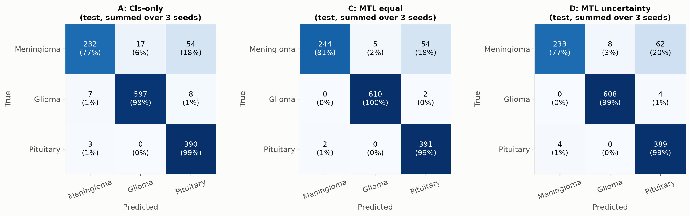

# Topic 2 — Tumor-Type Classification

Materials for the team member presenting **Topic 2 in [TASKS.md](../TASKS.md)**: classification method (slide 9) and classification results / confusion matrix (slide 12).

The classifier is already implemented in the shared project model. This folder explains that implementation and reproduces the classification tables from the existing recorded experiments; it does not introduce another model or claim new training results.

## Start here

1. Read [METHOD.md](METHOD.md) to understand the input, classification head, loss and metrics.
2. Read [RESULTS.md](RESULTS.md) for the regenerated A/C/D comparisons.
3. Use [SLIDE_NOTES.md](SLIDE_NOTES.md) for English slide copy and Thai speaking notes (~2 minutes total; rehearse and adjust).
4. Practise with [QA.md](QA.md).

## Regenerate the results

From the repository root, using Python 3.10 or newer:

```bash
python classification/report.py
```

Only the Python standard library is needed. No GPU, dataset or checkpoint is needed for this **table regeneration**.

Inputs: `results/all_runs_test.csv`, `results/errors_by_patient.csv`, `results/summary_test.csv` (reference check).

Outputs in this folder:

| File | Purpose |
|---|---|
| `RESULTS.md` | Classification results and interpretation limits |
| `summary.csv` | Numeric means and sample SD across seeds |
| `paired.csv` | Per-seed C−A and D−A Macro-F1 differences |
| `provenance.json` | Source hashes, source experiment commit and generation method |

The script validates the classification runs, requires matching seed sets, and checks every reported mean/SD against the committed reference table. It fails before writing reports if those inputs disagree. It also checks that patient-error totals agree with recorded accuracy when the slice/seed counts imply an integer test-set size.

To record a different source experiment revision after updating results:

```bash
python classification/report.py --source-commit <experiment-commit-sha>
```

## Figures for slide 12



Each panel sums predictions over three seeds: **436 test slices × 3 seeds = 1,308 predictions**, not 1,308 independent images or patients. Rows are true classes; columns are predicted classes. The figure is reused from the existing results package; it is not reconstructed from aggregate F1 scores.

Additional example: [misclassified MRI slices](../results/figures/7_C_mtl_equal_seed0_misclassified.png).

## Optional model reproduction

With the original data prepared and the project dependencies installed, use the existing pipeline:

```bash
python src/train.py --tasks cls --seed 0 --name A_cls_seed0
python src/evaluate.py --run runs/A_cls_seed0
```

Follow the root [README.md](../README.md) for data preparation and all A–D experiments. Data and checkpoints are not committed. Regenerating these tables verifies arithmetic on recorded results; it does not independently reproduce training or per-image predictions.

## Before presenting

- Explain all three classes and why this is classification rather than segmentation.
- Explain how segmentation supervision reaches the classifier through the shared encoder.
- Distinguish Macro-F1 from the harmonic mean of macro precision and macro recall.
- Read the confusion matrix axes and pooled-seed counts correctly.
- Describe limitations: 29 test patient groups, three seeds, no healthy class, and learning-rate tuning on C only.
- Use full-test-set scores in the main comparison; keep all difficult cases in the test set.
